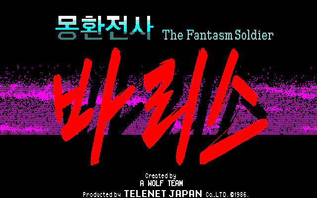

# PC-88 몽환전사 바리스 1 한글패치 빌드
<p align="center">
  

</p>
이 빌드는 PC-88판 《몽환전사 바리스 1》의 원본 이미지를 한글 패치로 적용하는 Python 기반 빌드입니다.

이 빌드는 사용자가 제공한 원본 D88과 `KANJI1.ROM`을 읽고, 분석과 디버거 확인을 거쳐 확정한 직접 바이트 패치표를 원본 이미지에 적용합니다. 여타 다른 현지화 패치와 달리 직접 디스크 섹터의 데이터를 수정하는 방식으로 진행합니다.

원본 이미지는 `QUASI88 0.7.4`의 디버그 기능을 사용해서 분석했습니다.

분석한 원본 이미지의 정보는 `source/accepted/media/d88-layout.json`, `KANJI1.ROM`은 `source/accepted/media/kanji1-layout.json`의 레이아웃을 확인하세요.

## 빌드 구성

- `analysis/`: 분석 근거 장부와 디버거 관찰 자료
- `source/accepted/`: 원문·한글 번역·제어 토큰·직접 바이트·KANJI1 글리프 원천표
- `tools/valis_rebuild/`: D88 처리기, 원본 바이트 검사기, 직접 기록기, ROM 생성기
- `tests/`: 소스·구조·직렬화·통합 검증
- `docs/`: 작업 문서

## 빌드 원칙

```text
분석 근거와 디버거 확인
        ↓ 수동 검토
확정된 원문·한글 번역·토큰·직접 바이트 표
        ↓ 원본 바이트 대조
원본 D88/ROM 복사본에 직접 기록
        ↓ 구조·해시·테스트 검증
재현된 D88/ROM
```

## 실행

저장소 루트에서 실행합니다.

```sh
PYTHONPATH=. python -m tools.valis_rebuild source-lint
PYTHONPATH=. python -m tools.valis_rebuild text-lint
PYTHONPATH=. python -m unittest discover -s tests -v
```

원본 D88과 KANJI1 ROM을 지정해 빌드합니다.

```sh
PYTHONPATH=. python -m tools.valis_rebuild build \
  --d88 /path/to/original.d88 \
  --rom /path/to/KANJI1.ROM \
  --out build/reproduction
```

출력을 검증합니다.

```sh
PYTHONPATH=. python -m tools.valis_rebuild verify \
  --d88 "build/reproduction/d88/valis_disk_a(K).d88" \
  --rom "build/reproduction/kanji/KANJI1(K).ROM"
```

결과를 기준 파일과 대조합니다.

```sh
PYTHONPATH=. python -m tools.valis_rebuild compare \
  --built "build/reproduction/d88/valis_disk_a(K).d88" \
  --reference /path/to/reference.d88 \
  --fail-on-diff
```

## 결과물과 보관 범위

빌드 결과는 `build/` 아래에 생성합니다.

## 문서

- [직접 바이너리 재현 빌드 안내서](docs/direct-binary-build.md)
- [분석 근거와 빌드 소스 대응표](docs/evidence-and-source-map.md)
- [재현 빌드 검증 절차](docs/reproducibility.md)

## 라이선스

이 저장소의 자체 제작 소프트웨어 코드와 빌드 스크립트, 테스트 코드는 [MIT License](LICENSE)로 배포합니다.

다만 원작 게임에서 파생된 데이터와 자료(원문·번역문, 분석용 바이트/테이블, ROM·디스크 이미지에서 유래한 데이터, 스크린샷·로고·이미지, 게임 자산에서 유래한 글리프 등)는 MIT 라이선스의 권리 부여 대상이 아닙니다. 해당 자료의 권리는 각 원저작권자에게 있습니다.

원본 상용 게임의 D88/ROM 이미지는 이 라이선스로 배포되지 않으며, 빌드에 필요한 원본 미디어는 사용자가 적법하게 준비해야 합니다.

## 주의
이 빌드는 비공식 한글 패치이며, 모든 저작권은 원작자에게 있습니다.
